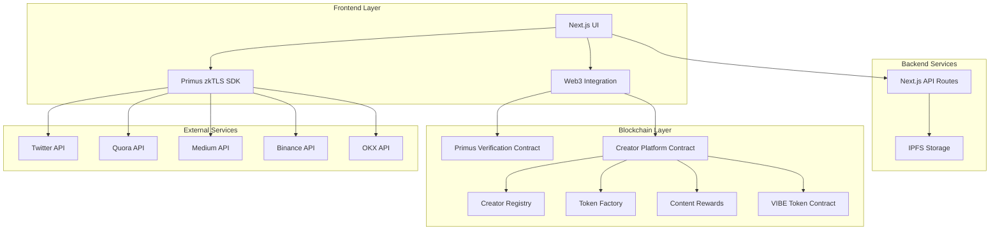

# Design Document

## Overview

The Vibe zkTLS platform is a comprehensive creator economy system that leverages zero-knowledge Transport Layer Security (zkTLS) technology for privacy-preserving identity verification. The platform enables creators to verify their social media accounts across multiple platforms, build reputation scores, create personal tokens, and participate in an automated content reward system.

The system is built as a decentralized application (dApp) on Monad testnet, combining modern web technologies with blockchain infrastructure to create a secure, transparent, and user-friendly creator platform.

## Architecture

### High-Level Architecture



### System Components

1. **Frontend Application**: Next.js 14 with TypeScript, providing responsive UI and Web3 integration
2. **zkTLS Integration**: Primus SDK for privacy-preserving identity verification
3. **Smart Contract System**: Modular contract architecture for creator management and token economics
4. **Content Storage**: IPFS for decentralized content storage
5. **Multi-Platform Support**: Integration with various social and trading platforms

## Components and Interfaces

### Frontend Components

#### Core UI Components
- **WalletConnection**: MetaMask integration with network switching
- **PlatformVerification**: Multi-platform zkTLS verification interface
- **CreatorDashboard**: Comprehensive creator management interface
- **TokenCreation**: Personal token deployment interface
- **ContentManagement**: Content publishing and tracking interface
- **RewardManagement**: Reward pool and distribution management

#### Shared UI Library
- **Shadcn/ui Components**: Button, Card, Input, Select, Tabs, Progress, Alert, Badge
- **Custom Components**: Platform-specific verification cards, level indicators, reward calculators

### Smart Contract Architecture

#### Core Contracts

**CreatorPlatform.sol** - Main orchestration contract
```solidity
interface ICreatorPlatform {
    function verifyPlatform(Attestation calldata attestation, PlatformType platformType) external;
    function createCreatorToken(string memory name, string memory symbol) external returns (address);
    function createContent(string memory contentHash, string memory title, string memory platform) external returns (bytes32);
    function fundRewardPool(uint256 amount) external;
    function getCreatorProfile(address creator) external view returns (CreatorProfile memory);
}
```

**CreatorRegistry.sol** - Creator identity and reputation management
```solidity
interface ICreatorRegistry {
    function verifyPlatform(Attestation calldata attestation, PlatformType platformType) external;
    function updateCredibilityScore(address creator, uint256 scoreChange) external;
    function getCreatorLevel(address creator) external view returns (uint256);
    function canCreateToken(address creator) external view returns (bool);
}
```

**TokenFactory.sol** - Personal token creation and management
```solidity
interface ITokenFactory {
    function createCreatorToken(string memory name, string memory symbol) external returns (address);
    function getCreatorToken(address creator) external view returns (address);
}
```

**ContentRewards.sol** - Content and reward management
```solidity
interface IContentRewards {
    function createContent(string memory contentHash, string memory title, string memory platform) external returns (bytes32);
    function fundRewardPool(uint256 amount) external;
    function distributeRewards(bytes32 contentId, address[] memory users, uint256[] memory amounts) external;
    function getCreatorStats(address creator) external view returns (CreatorStats memory);
}
```

**VibeTokenV2.sol** - Platform utility token
```solidity
interface IVibeToken {
    function claimTokens(Attestation calldata attestation) external;
    function hasClaimed(address user) external view returns (bool);
    function usedScreenNames(string memory screenName) external view returns (bool);
}
```

### API Interfaces

#### zkTLS Configuration API
```typescript
// /api/zktls/config/route.ts
interface ZKTLSConfigResponse {
  appId: string;
  signedRequest: string;
}

// /api/zktls/sign/route.ts
interface ZKTLSSignRequest {
  signParams: string;
}

interface ZKTLSSignResponse {
  signResult: string;
}

// /api/zktls/verify/route.ts
interface ZKTLSVerifyRequest {
  attestation: Attestation;
  platformType: string;
}

interface ZKTLSVerifyResponse {
  isValid: boolean;
  extractedData: any;
}
```

#### Content Management API
```typescript
// Content storage and retrieval
interface ContentAPI {
  uploadToIPFS(content: ContentData): Promise<string>;
  getFromIPFS(hash: string): Promise<ContentData>;
  updateMetrics(contentId: string, metrics: InteractionMetrics): Promise<void>;
}
```

### Data Models

#### Creator Profile
```typescript
interface CreatorProfile {
  wallet: string;
  verifiedPlatforms: string[];
  credibilityScore: number;
  creatorLevel: number;
  personalToken: string;
  canIssueTokens: boolean;
  verifiedAt: number;
}
```

#### Platform Verification
```typescript
interface PlatformVerification {
  platform: PlatformType;
  username: string;
  verifiedAt: number;
  attestationHash: string;
  scoreContribution: number;
}

enum PlatformType {
  TWITTER,
  QUORA,
  MEDIUM,
  BINANCE,
  OKX
}
```

#### Content Data
```typescript
interface ContentData {
  id: string;
  creator: string;
  title: string;
  description: string;
  ipfsHash: string;
  platform: string;
  createdAt: number;
  metrics: InteractionMetrics;
}

interface InteractionMetrics {
  views: number;
  likes: number;
  shares: number;
  comments: number;
}
```

#### Reward Pool
```typescript
interface RewardPool {
  creator: string;
  tokenAddress: string;
  balance: number;
  baseReward: number;
  totalDistributed: number;
  isActive: boolean;
}
```

## Error Handling

### Frontend Error Handling

#### Wallet Connection Errors
- **MetaMask Not Installed**: Display installation instructions with download link
- **Network Mismatch**: Automatic network switching with fallback manual instructions
- **Connection Rejected**: Clear error message with retry option
- **Transaction Failures**: Detailed error messages with transaction hash and explorer links

#### zkTLS Verification Errors
- **SDK Initialization Failure**: Fallback to manual verification with clear instructions
- **Platform Authentication Failure**: Platform-specific error messages with troubleshooting steps
- **Proof Generation Failure**: Retry mechanism with exponential backoff
- **Verification Timeout**: Clear timeout message with retry option

#### Smart Contract Interaction Errors
- **Insufficient Gas**: Gas estimation with user-friendly explanation
- **Contract Revert**: Decode revert reasons and display user-friendly messages
- **Network Congestion**: Retry mechanism with status updates
- **Invalid Parameters**: Input validation with specific field error messages

### Smart Contract Error Handling

#### Access Control
```solidity
error Unauthorized(address caller, string required);
error InsufficientLevel(uint256 current, uint256 required);
error TokenAlreadyExists(address creator);
error PlatformAlreadyVerified(address creator, PlatformType platform);
```

#### Validation Errors
```solidity
error InvalidAttestation(string reason);
error ExpiredAttestation(uint256 timestamp);
error InvalidRecipient(address expected, address actual);
error DuplicateScreenName(string screenName);
error InsufficientBalance(uint256 available, uint256 required);
```

#### Business Logic Errors
```solidity
error AlreadyClaimed(address user);
error RewardPoolEmpty(address creator);
error ContentNotFound(bytes32 contentId);
error InvalidRewardAmount(uint256 amount);
```

### Error Recovery Strategies

1. **Automatic Retry**: For transient network errors with exponential backoff
2. **Graceful Degradation**: Fallback to basic functionality when advanced features fail
3. **User Guidance**: Clear instructions for manual resolution of common issues
4. **State Recovery**: Ability to resume interrupted processes from saved state
5. **Error Reporting**: Comprehensive logging for debugging and monitoring

## Testing Strategy

### Frontend Testing

#### Unit Testing
- **Component Testing**: React Testing Library for UI component behavior
- **Hook Testing**: Custom hooks for Web3 interactions and state management
- **Utility Testing**: Pure functions for data transformation and validation
- **API Testing**: Mock API responses and error scenarios

#### Integration Testing
- **User Flow Testing**: Complete user journeys from wallet connection to token claiming
- **Web3 Integration**: Mock blockchain interactions and contract calls
- **zkTLS Integration**: Mock Primus SDK responses and error scenarios
- **Cross-Component Testing**: Component interaction and data flow

#### End-to-End Testing
- **Playwright/Cypress**: Full browser automation testing
- **Multi-Platform Testing**: Different browsers and devices
- **Network Simulation**: Various network conditions and failures
- **User Scenario Testing**: Real-world usage patterns

### Smart Contract Testing

#### Unit Testing (Forge)
```solidity
// Example test structure
contract CreatorPlatformTest is Test {
    function testVerifyPlatform() public {
        // Test platform verification logic
    }
    
    function testCreateToken() public {
        // Test token creation permissions and logic
    }
    
    function testRewardDistribution() public {
        // Test reward calculation and distribution
    }
}
```

#### Integration Testing
- **Contract Interaction**: Multi-contract workflows and state consistency
- **Primus Integration**: Mock Primus contract responses
- **Token Economics**: Reward calculations and distribution logic
- **Access Control**: Permission systems and role-based access

#### Security Testing
- **Reentrancy Protection**: Attack simulation and prevention verification
- **Access Control**: Unauthorized access attempts and privilege escalation
- **Input Validation**: Malformed data and edge case handling
- **Economic Attacks**: Token manipulation and reward gaming scenarios

#### Gas Optimization Testing
- **Gas Usage Analysis**: Function-level gas consumption measurement
- **Optimization Verification**: Before/after optimization comparisons
- **Batch Operation Testing**: Efficiency of batch vs individual operations
- **Storage Optimization**: Gas costs of different storage patterns

### Performance Testing

#### Frontend Performance
- **Load Time Testing**: Page load and component rendering performance
- **Memory Usage**: Memory leaks and optimization verification
- **Bundle Size**: JavaScript bundle optimization and code splitting
- **Network Performance**: API response times and caching effectiveness

#### Smart Contract Performance
- **Transaction Throughput**: Maximum transactions per block
- **Gas Efficiency**: Optimization of contract operations
- **State Management**: Efficient storage and retrieval patterns
- **Batch Processing**: Bulk operation performance

### Test Data Management

#### Mock Data
- **Creator Profiles**: Various levels and verification states
- **Platform Attestations**: Valid and invalid zkTLS proofs
- **Content Data**: Different types and interaction patterns
- **Token Economics**: Various reward scenarios and calculations

#### Test Networks
- **Local Development**: Anvil for rapid iteration
- **Monad Testnet**: Integration testing with real network conditions
- **Fork Testing**: Mainnet state forking for realistic testing

### Continuous Integration

#### Automated Testing Pipeline
1. **Code Quality**: ESLint, Prettier, TypeScript compilation
2. **Unit Tests**: Jest for frontend, Forge for contracts
3. **Integration Tests**: Cross-component and contract interaction testing
4. **Security Scans**: Slither for smart contracts, dependency vulnerability scans
5. **Performance Tests**: Bundle size analysis and gas usage reports
6. **Deployment Tests**: Automated deployment to test networks

#### Test Coverage Requirements
- **Frontend**: Minimum 80% code coverage
- **Smart Contracts**: Minimum 90% code coverage
- **Critical Paths**: 100% coverage for security-critical functions
- **Error Scenarios**: Comprehensive error condition testing